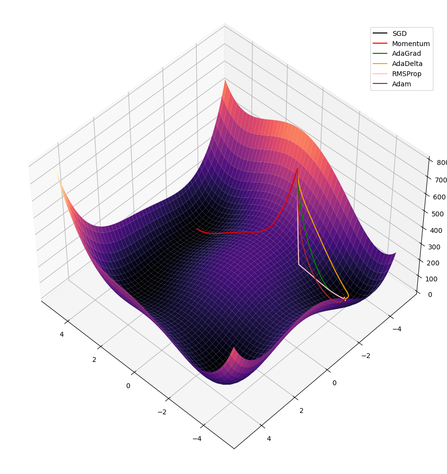

# Optimiser Playground
This is a set of manually-implemented optimization/gradient descent algorithms, typically used for machine learning:
- Vanilla/traditional gradient descent
- Momentum
- AdaGrad
- AdaDelta
- RMSProp
- Adam

They are built using only numpy as an exercise. The gradients are estimated by sampling the value of the target function at nearby points.

## Quickstart
Install `numpy` and `matplotlib`, then run:
```bash
python main.py -o SGD Momentum AdaGrad AdaDelta RMSProp Adam -f himmelblau --start_point 0.2 -4.5
```
This runs the various optimisers on Himmelblau's function starting at point (0.2, -4.5), and should give a result similar to the below image:



Note that Himmelblau's function has four distinct global minima.

## Usage

```
usage: python main.py [-h] [-o {sgd,momentum,adagrad,adadelta,rmsprop,adam} [{sgd,momentum,adagrad,adadelta,rmsprop,adam} ...]] [-f {sphere,beale,goldstein_price,booth,himmelblau,threehumpcamel,rastrigin,rosenbrock,ackley}] [--start_point START_POINT START_POINT]

Demo for different optimisers, implemented in numpy, with choice of test functions.

options:
  -h, --help            show this help message and exit
  -o {sgd,momentum,adagrad,adadelta,rmsprop,adam} [{sgd,momentum,adagrad,adadelta,rmsprop,adam} ...], --optimiser {sgd,momentum,adagrad,adadelta,rmsprop,adam} [{sgd,momentum,adagrad,adadelta,rmsprop,adam} ...]
                        Which optimiser(s) to use.
  -f {sphere,beale,goldstein_price,booth,himmelblau,threehumpcamel,rastrigin,rosenbrock,ackley}, --test_fn {sphere,beale,goldstein_price,booth,himmelblau,threehumpcamel,rastrigin,rosenbrock,ackley}
                        What demo function to use.
  --start_point START_POINT START_POINT
  ```

